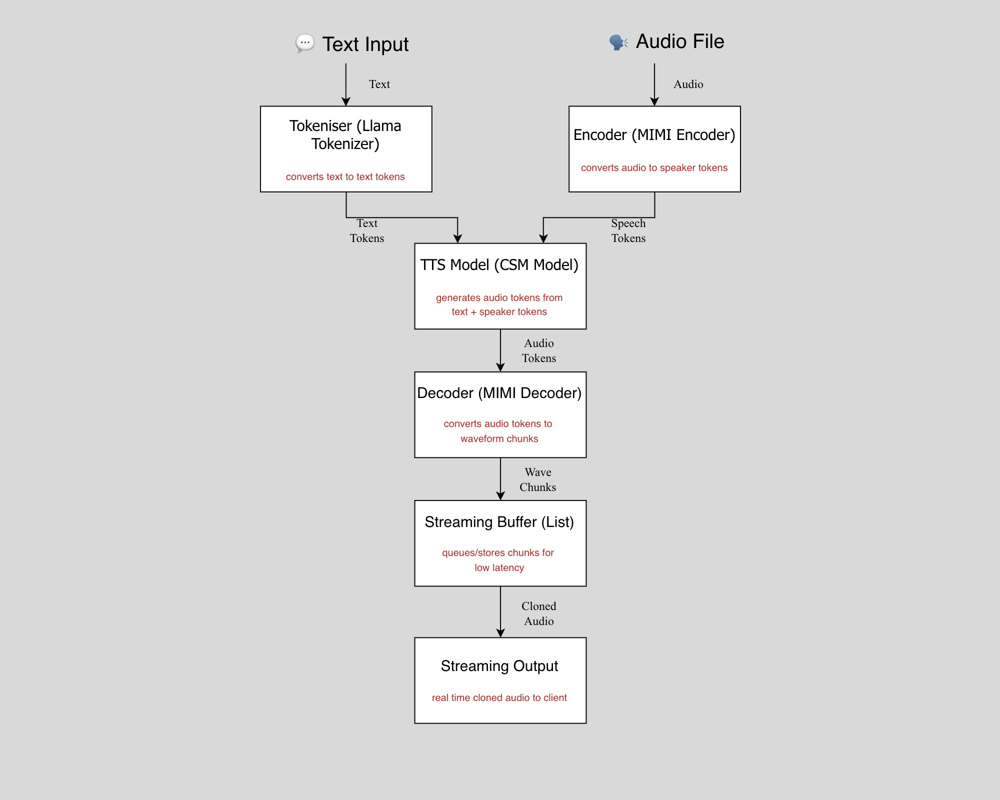

# Real-Time Open Source Text-to-Speech
A high-performance, real-time Text-to-Speech (TTS) engine built from scratch around Sesame's CSM-1B model. 

### Why I Built This
I started this project out of frustration. If you look at the current AI landscape, there are almost no *truly* real-time, high-quality, open-source streaming TTS models. Everything good is locked behind a paid API (like ElevenLabs or OpenAI), and the open-source alternatives either force you to wait for entire sentences to generate before playing audio, or they sound robotic. 

I wanted a system that could generate human-sounding speech instantly. So, I took Sesame's CSM-1B model and completely re-engineered its inference pipeline to support chunk-based WebSocket streaming.

## Architecture & Demo

    

https://github.com/user-attachments/assets/44bc2031-f10c-4587-acec-2b98c188f5f1

## The Models Under the Hood
The engine is powered by **Sesame CSM-1B**, a 1 billion parameter conversational speech model built on a Llama transformer backbone. Unlike traditional TTS models that just do a basic text-to-waveform conversion, CSM-1B processes text and audio inputs simultaneously using a multimodal architecture. 

* **Text Processing:** Uses the `meta-llama/Llama-3.2-1B` tokenizer.
* **Audio Processing:** Uses the **Mimi** audio codec (developed by Kyutai). The engine generates Residual Vector Quantization (RVQ) audio codes, which are then decoded into high-fidelity speech waveforms.
* **The Catch:** Out of the box, CSM-1B is a base generation model-it doesn't have predefined, fine-tuned voices. We use this to our advantage for dynamic voice cloning.

## How I Achieved Real-Time Streaming (Optimizations)
Getting a 1B parameter LLM and an audio decoder to stream seamlessly without stuttering required aggressive system-level optimizations:

1. **JIT Compilation:** Both the Llama backbone and the audio decoder are pre-compiled using `torch.compile(mode='reduce-overhead')`. This drastically cuts down the Python overhead during the autoregressive generation loop.
2. **Hardware Acceleration:** Enforced TensorFloat-32 (TF32) matrix multiplications for maximum throughput on NVIDIA architectures.
3. **Thread Locking:** Set `OMP_NUM_THREADS=1` and `MKL_NUM_THREADS=1`. Without this, PyTorch tries to hog every CPU core, which starves the FastAPI WebSocket loop and causes the audio to stutter.
4. **Memory Management:** Enabled `expandable_segments:True` for CUDA memory allocation to prevent fragmentation during long, unlimited streaming sessions.
5. **Smart Chunking:** Text is split and fed into the model dynamically. The first audio chunk uses a smaller frame threshold (20 frames) to guarantee sub-second first-packet latency, while subsequent chunks use larger buffers for smooth playback.

## The Voice Cloning API (Built for MSMEs)
Because CSM-1B doesn't rely on hardcoded voices, I built a dynamic Voice Cloning API around it. This is designed as a drop-in solution for MSMEs (Micro, Small, and Medium Enterprises) wanting to automate customer service.

Instead of training a new model, you simply drop a short `.wav` reference file into the `voice_cloning/voices/` directory. On startup, the engine pre-tokenizes this audio into persistent GPU memory and instantly provisions a dedicated WebSocket endpoint (`ws://.../api/{voice_name}`). 

## Tech Stack
* **AI/ML:** PyTorch, Torchaudio, Hugging Face Transformers.
* **Backend:** Python 3.10, FastAPI, Uvicorn, WebSockets, Asyncio.
* **Frontend:** Vanilla JavaScript (Web Audio API for decoding raw `Float32Array` streams).
* **Infrastructure:** Docker, NVIDIA Container Toolkit, AWS EC2.

## Deployment & Documentation
This repository is structured for both containerized deployments and bare-metal execution.

1. **[Docker Deployment Guide](docs/docker-deployment.md):** Includes instructions for setting up the EC2 host, injecting environment variables (`HF_TOKEN`), and running the specific project milestones.
2. **[Normal Setup](docs/normal-deploymeny.md):** For running the system natively without Docker. Covers NVIDIA driver installation, virtual environments, and system-level `sudo` execution.